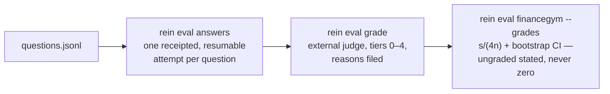

# Rein

**English** · [简体中文](README.zh-CN.md)

**A standalone CLI/TUI harness for bounded, evidence-first financial
research.**

*Reins are the harness on an animal whose strength you rent but do not own.*
You declare the research task and its output contract; a **hand** — a model
CLI, a deterministic computer, a conformance fixture — does the work inside a
fenced attempt; Rein captures everything every channel emitted, validates the
artifacts, classifies the outcome **from receipts, never from exit codes or
model prose**, and leaves you a replayable, self-verifying evidence trail.

**In plain words:** Rein is a work harness for an AI research assistant
doing financial analysis. It makes the assistant keep a receipt for every
number, writes everything into a notebook that cannot be erased or
rewritten, refuses to guess when it does not know, and lets you check any
claim later — down to the exact page or filing it came from. If the work
was sloppy, Rein says so plainly; no button anywhere can paint it green.
New here? Read [the story so far](docs/STORY.md) — no technical background
needed.

```sh
rein run task:dcf-nvda@1 --hand agy --wait --require task-satisfied
# exit 0 ⇔ a verified TaskSelectionReceipt exists — and nothing less
```



```mermaid
flowchart LR
    OP["You declare a task<br/>+ output contract"] --> PACK["ContextPack<br/>inputs pinned &amp; hashed,<br/>then frozen"]
    PACK --> HAND["A hand runs ONE attempt<br/>(model · calculator · fixture)"]
    HAND --> CAP["Everything captured:<br/>stdout, stderr, artifacts"]
    CAP --> CAS["Content-addressed store<br/>+ independent read-back"]
    CAS --> VAL["Validators<br/>(11 automated inspectors)"]
    VAL --> CLS["Classifier reads receipts —<br/>never exit codes, never prose"]
    CLS --> LEDGER["Append-only ledger<br/>(enforced by DB triggers)"]
    LEDGER --> YOU["You: replay, verify,<br/>or challenge any claim"]
```

It is a single binary with no services to run: SQLite for the ledger
(append-only *by trigger*), a content-addressed file store for every artifact
and captured page, and a four-screen TUI over the same domain core.

## Why it exists

Model-driven research fails in ways ordinary pipelines don't see: a process
exits 0 having produced nothing; a confident summary cites pages nobody
fetched; a valuation rests on a hallucinated beta; yesterday's API quietly
serves today's restated figures into a "point-in-time" backtest. Rein's
answer is structural:

- **Six claims, six vocabularies, never one badge** — process completion ≠
  artifact completion ≠ attempt outcome ≠ task satisfaction ≠ research
  acceptance ≠ system admission.
- **`success` is earned**: every required artifact committed
  content-addressed *and read back through a handle the writer did not own*,
  every mandatory validator passed, no unresolved policy failure — then a
  classifier receipt says so.
- **`unknown` stays unknown.** It never defaults to anything, and
  force-success does not exist — not as a function, a CLI action, or a
  keybinding.
- **Numbers arrive stamped or not at all**: `{value, unit, as_of(+basis),
  provider, retrieved_at}` — and a past-cutoff epoch may read only Rein's own
  captures made inside the cutoff, because live vendor data is
  current-vintage and no query parameter can unwind a restatement.
- **Assumptions are inputs with provenance.** A compute parameter is a
  capture citation, a cited claim, or a justified assumption — a bare float
  is unrepresentable, and the DCF must recompute from the assumptions file
  alone.
- **Everything replays.** Same frozen ContextPack through two deterministic
  hands ⇒ identical artifact digests; `rein replay attempt --strict` proves
  it, and a single tampered byte anywhere reddens verification.

## Build

```sh
cargo build --release        # rustc/cargo 1.82+; Cargo.lock committed & pinned
cargo test                   # 93 tests — the whole suite runs standalone
```

No external services, accounts, or sibling checkouts are required to build or
to run the deterministic core. Everything network- or model-shaped is an
optional integration that **refuses with stated reasons** when absent, rather
than degrading silently.

## Quickstart

Every command takes `--output table|json|yaml|ndjson`, prints a stable JSON
envelope (`rein.cli-result/v1`) on stdout with diagnostics on stderr, and
defines `ok` as exactly `exit code == 0`.

### Sixty seconds, offline

```sh
mkdir book && cd book
rein init
rein mission create etf-book --objective "maintain valuations"
rein epoch open 2026-08 --mission etf-book \
    --source-cutoff 2026-08-18T00:00:00Z --seal

cat > plan.yaml <<'EOF'
plan_ref: plan:demo@1
nodes:
  - task_ref: task:proof@1
    task_type: fixture
EOF
rein plan apply -f plan.yaml

rein run task:proof@1 --hand fake:deterministic-a \
    --wait --require task-satisfied
rein attempt list
rein replay attempt <id> --strict          # re-run, re-hash, compare
rein attempt retry <id> --hand fake:deterministic-b
                                           # same pack, new generation,
                                           # identical digests — provably
```

### A real valuation on live data

```sh
# Credentials live in configRoot (~/.config/rein/), never the workspace:
#   secrets.toml:  fmp = "<key>"      — or export FMP_API_KEY,
#   config.toml:   fmp_env_file = "…" — or point at an existing env file.

rein data pull-equity NVDA --kinds quote,cashflow,balance
rein capture list                          # stamped rows, bytes in the CAS

rein task add task:dcf-nvda@1 --plan plan:demo@1 --type valuation \
    --universe security:nvda \
    --input capture:<digest> --input capture:<digest> --input capture:<digest>

rein run task:dcf-nvda@1 --hand finance:deterministic \
    --wait --require task-satisfied
rein artifact cat <valuation.json digest>
```

The valuation contract is split on purpose: `assumptions.json` carries every
input with its basis and faces the research validators; `valuation.json`
carries the arithmetic and must **recompute from the assumptions alone**
(`numeric-consistency`). The EV→equity→per-share bridge is mandatory;
sensitivity rows and at least one statable falsifier are required, or the
valuation is not decision-ready. Missing inputs become *counted, justified
defaults* — the coverage denominator is real, and silent truncation fails
validation.

Growth is an input with provenance, never a buried constant. The 5-year FCF
path resolves in order: an operator-pinned `growth` capture (`rein data pin
growth.json --note growth`, carrying flat `growth`, an exact `g` 5-vector,
`discount_rate`, `terminal_growth` — operator authority, no clamp) → the
pinned analyst-estimates capture's revenue endpoint CAGR (clamped [−10%,
+40%]; out-year average dips are coverage artifacts, and endpoint CAGR
ignores them) → the captured FCF history's CAGR (clamped [0, 25%]) → a
stated default. Every year's slot names its derivation and source digest.

Swap in a real model with `--hand agy` (any model the `agy` CLI serves; set
`agy_model` in config.toml). The
adapter spawns it by absolute path, one attempt, no internal retries; the
model supplies assumptions, **the adapter recomputes the arithmetic**, and an
empty or non-SUCCESS response is an error regardless of exit code.

### Deep research over pinned sources

```sh
# Pin the evidence first — including the last four earnings-call
# transcripts, each captured as-of its call date:
rein data pull-equity NVDA --kinds quote,income,income-q,cashflow,balance,estimates,transcripts

rein task add task:research-nvda@1 --plan plan:demo@1 --type research \
    --universe security:nvda \
    --input capture:<digest> …            # ten sources beats four

rein run task:research-nvda@1 --hand agy --wait --require task-satisfied
```

The research hand runs a staged method (plan → per-section investigation →
synthesis) drawn from the `research.md` skill, whose exact bytes ride the
pack hash. The model cites numbered sources and **never writes a digest** —
the adapter maps every `[N]` onto the pinned capture's real fingerprint, so
`citation-closure` can hold that *a word in brackets is not a citation*.
The dossier must carry scenarios with falsifiers; the claims file must make
coverage add up (consumed + withheld = pinned). Press **Enter** on the
attempt in the TUI to read the dossier in place.

A `claims.json` slot, for the flavor of what survives validation:

```json
{ "text": "FY2026 free cash flow was $96.68B",
  "kind": "fact", "evidence": [2],
  "falsifier": "restated 10-K cash-flow statements showing different figures" }
```

### Skills — playbooks that evolve under governance

Every task type reads its method from a markdown playbook in
`.rein/skills/` (fourteen ship by default — valuation, staged research,
verify, settle, monitor, answer, earnings-review, risk-map, thesis-memo,
filing-review, …). The library grows from evidence, with a boundary:

```sh
rein skill new bank-valuation --applies-to valuation \
    --from-attempt attempt_001891      # distill a draft from real receipts
rein skill validate bank-valuation     # deterministic gate (exit 13 on fail)
rein skill promote bank-valuation      # OPERATOR act — drafts never
                                       # enter force by themselves
```

### Evidence, recovery, settlement

```sh
rein evidence bundle <attempt> --out nvda.evidence.tar.zst
rein evidence verify nvda.evidence.tar.zst   # re-hash every file, re-seal the
                                             # pack, replay the receipt chain,
                                             # gap-check the event streams
rein recover                                 # typed-anomaly queue
rein attempt recover <id>                    # diagnosis first; then exactly
                                             # three actions: resume-commit |
                                             # retry | close-unknown
rein eval answers -f qs.jsonl --hand agy            # one receipted attempt
rein eval grade -f qs.jsonl --answers answers.json  #   per question, resumable
rein eval financegym -f qs.jsonl \                  # judge tiers 0–4 →
    --answers answers.json --grades grades.json     #   s/(4n), bootstrap CI;
rein eval internal                                  # scores never touch
                                                    #   outcomes, ever
```



Task types beyond `research` and `valuation`: `verify` (verdict per claim,
challenger must be a different hand, the harsher verdict wins), `settle`
(due valuations settled against realized evidence — confirmed/contradicted
never invented, `expired_unobserved` only when nothing bears), `monitor`
(driver diffs, moved values only — a row inserted is not a value changed).

## The TUI

```sh
rein tui
```

| Screen | What it shows |
|---|---|
| **1 · Mission Control** | Current Truth (epoch, cutoff, PIT mode, providers.lock hash), tasks with their adjudication, attempts whose outcome cells name their receipt (`success per rcpt_000123`) |
| **2 · Live Attempt** | The six vocabularies as six separate fields — for a green-but-empty run you *see* the disagreement: child exit 0 · artifacts absent · outcome artifact_invalid |
| **3 · Recovery Console** | Typed anomalies with diagnoses; three actions behind y/n confirms; no force-success key exists |
| **4 · Compare** | Two attempts, differences classified: expected-environmental / nonsemantic-receipt / semantic-input / output / policy / unexplained |

**Enter opens the results viewer** from any attempt row: the attempt's
committed artifacts with their validator verdicts and content inline —
valuations and answers pretty-printed, read back through the CAS, scrollable
(`j/k`), `n`/`p` across artifacts. The shell stays live: a tab bar and
per-screen keybar frame every screen, an activity spinner counts running
attempts, and a terminal outcome landing while you watch is announced as a
toast naming its receipt.

Keys: `?` help · `:` palette · `g`+`1–4` goto · `j/k` move · `Enter` open
results · `a`/`b` mark a compare pair · `F2` mouse capture · `Esc` unwinds
popup → results → selection → quit.
Committed evidence panes are double-bordered `[committed]`; live reads are
plain `[live]`. Empty panels state their emptiness — an empty panel and a
failed one mean opposite things.

## Reference

**Exit codes** (closed vocabulary; child exits are captured *inside* evidence,
never passed through): `0` asserted-true · `2` usage · `4` not-found · `5`
conflict/stale-fence · `6` provider unresolved · `7` policy denied · `8`
budget · `9` transport · `10` attempt terminal non-success · `11` unknown ·
`12` artifact commit/readback failed · `13` validation wait-assertion failed ·
`14` cancelled/timeout · `15` evidence/replay mismatch · `70` internal.

| Outcome | exit | | Outcome | exit |
|---|---|---|---|---|
| success | 0 | | budget_exhausted | 8 |
| partial_success | 10 | | policy_denied | 7 |
| failure | 10 | | artifact_invalid | 12 |
| cancelled / timed_out | 14 | | unknown | 11 |

`--wait --require <a>` certifies one assertion via a verified receipt:
`attempt-terminal` · `artifact-committed` · `validation-passed` (unmet → 13) ·
`task-satisfied` · `plan-completed`. **Without `--wait`, exit 0 means
admitted-and-ran and asserts nothing about the outcome** — the envelope says
so in its warnings.

**Validators**: `artifact-wellformed` · `secret-scan` (a leak quarantines the
artifact and withholds it from selection) · `input-closure` · 
`numeric-consistency` · `bridge-completeness` · `falsifier-present` ·
`source-cutoff` · `fact-vs-forecast` (a post-cutoff year stated as fact
fails) · `citation-closure` (`[N]` must resolve to captured bytes; a word in
brackets is not a citation) · `coverage-denominator` · `ops-discipline`.
SKILL.md playbooks in `.rein/skills/` add validators to a task's contract at
pack freeze — enforcement lives on the side the executor does not control.
The library self-evolves under governance: `rein skill new <name>
--from-attempt <id>` distills run evidence into a draft (provenance in
`distilled_from`), `rein skill validate` gates it deterministically, and
only `rein skill promote` — an operator act — puts a draft into force.

**Configuration** — `configRoot` (default `~/.config/rein/`, override
`--config-root` / `REIN_CONFIG_ROOT`) holds credentials and is **refused if
it sits inside the workspace**:

```toml
# config.toml                            # secrets.toml
default_hand = "finance:deterministic"   # fmp    = "…"
searxng_url  = "http://localhost:8080"   # <name> = "…"  → secret-ref:<name>
fmp_env_file = "/path/to/.env"
agy_path     = "agy"
agy_model    = "gemini-3.7-flash-low"
agora_key_path = "~/.agora/rein-party-key"
agora_hub      = "https://agora.example"
```

Workspace layout (`.rein/`): `workspace.yaml` · `providers.lock` · `policies/`
· `plans/` · `skills/` · `ledger.db` · `objects/` (CAS) · `cache/` · `logs/` ·
`tmp/`.

## Optional integrations

Everything below is opt-in; none of it is needed to build, test, or run the
deterministic core, and each refuses with a stated reason when unconfigured.

- **Market data** — Financial Modeling Prep via `FMP_API_KEY` (or
  secrets.toml / an env-file pointer). Every pull is captured to the CAS and
  provider-stamped; the PIT gate refuses live pulls under eval mode or a
  past cutoff.
- **Model hands** — any model behind the `agy` CLI, spawned with retries
  disabled and its self-reports treated as evidence only.
- **Web research** — SearXNG for search, capped captures per host
  (syndication is not corroboration).
- **A coordination hub** — `rein evidence publish <attempt> --room <id>`
  posts a bundle summary (with its sha256) to an AGORA room, using a party
  key and hub URL from configRoot (`agora_hub`, or `--hub`; no endpoint is
  baked in). Publication is explicit, never ambient, and a hub outage can
  never stop a run.

## Design, guarantees, provenance

The project's update story, written for readers with no technical
background, is at [`docs/STORY.md`](docs/STORY.md) (English) and
[`docs/STORY.zh-CN.md`](docs/STORY.zh-CN.md) (中文).
A detailed introduction in Simplified Chinese, with diagrams, is at
`docs/INTRO.zh-CN.md`. The build follows an internal design document (v0.2,
sha256 `e685d399…97cb0`) that is not shipped here; its enforceable surface
is `docs/INVARIANTS.md`, which maps all **33 invariants → production symbol
→ reddening test — 33/33 green**. Deviations from the design text (two objections, the
hand-binding hash exclusion) are recorded decisions with their reasons, and
reversing any of them silently reddens tests.
Deliberately unbuilt, each with a stated reinstatement condition: lease
service, multi-tenant/remote execution, container sandbox tiers, plugin PKI,
`backtest`.

Crates: `rein-core` (pure contracts — no clock, no randomness, no I/O) ·
`rein-runtime` (ledger, CAS, pipeline, replay, recovery, evidence) ·
`rein-finance` (data/compute tools, validators, skills, hands, eval) ·
`rein` (CLI + TUI).

## Lineage

Rein did not appear from nowhere; it is one instrument in a small estate of
research tooling, and the relationships explain several of its design
choices.

- **AGORA** is the coordination protocol the estate's autonomous parties
  use: append-only rooms where findings must carry evidence and *what would
  refute them*, gates only a human can acknowledge, and messages from other
  parties treated as untrusted input. Rein was built *as* an AGORA party —
  its entire construction, every design objection, ruling, and milestone,
  lives in an append-only room record — and `rein evidence publish` speaks
  the same protocol: explicit, never ambient.
- **AI Institute** is the research organization behind the estate. Its
  house doctrine — evidence or it didn't happen; absence is stated, never
  blank; nothing self-authorizes — predates Rein, and Rein is that doctrine
  compiled into a runtime.
- **ResearchOS** is the wider program: an operating layer for accountable
  research, with separately owned seams for knowledge contracts, execution,
  assurance, storage, and review. Rein occupies the execution-evidence seam
  — it runs attempts and proves what happened — and deliberately claims no
  other: it consumes contracts, and refuses to be a gold authority.
- **Rho** is a sibling: a local-first research-graph terminal with a human
  review gate, where research is proposed and adjudicated but never
  self-admitted. Rein and Rho share design DNA — receipts, gates, the
  absence of any force-success — and share **zero code**: a test enforces
  that Rein's dependency graph is workspace + public registry only. The
  early design once carried a direct crossing; the public build removed it,
  and what remains is kinship, not coupling.

## License

Licensed under either of [Apache License 2.0](LICENSE-APACHE) or
[MIT license](LICENSE-MIT) at your option. Unless you explicitly state
otherwise, any contribution intentionally submitted for inclusion in the work
by you, as defined in the Apache-2.0 license, shall be dual licensed as
above, without any additional terms or conditions.

Not published to crates.io.
