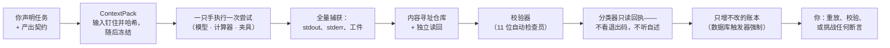
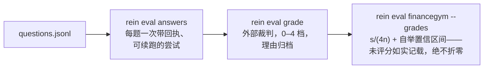

# Rein（缰绳）

[English](README.md) · **简体中文**

**一个独立的 CLI/TUI 金融研究执行框架：有边界、证据优先。**

*Rein 意为缰绳——套在一头你租用其力气、却并不拥有它的牲口身上的挽具。*
你声明研究任务和产出契约；一只"手"——模型 CLI、确定性计算器、或一致性
夹具——在围栏内完成一次尝试；Rein 捕获每条通道的全部输出，校验工件，
**只凭回执、绝不凭退出码或模型的自述**来分类结果，并留下一条可重放、
可自校验的证据链。

**说人话：** Rein 是给做金融分析的 AI 研究助手套上的一副"工作缰绳"。
它要求助手为每一个数字留下凭据，把所有过程写进一本擦不掉、改不了的
账本；不知道就是不知道，绝不装懂；事后你可以核查任何一句结论——一直
追到它引用的那一页原文。活儿干得不合格，Rein 会直说；整个系统里不存在
任何一个能把它"刷绿"的按钮。刚认识这个项目？先读
[《到目前为止的故事》](docs/STORY.zh-CN.md)，不需要技术背景。

```sh
rein run task:dcf-nvda@1 --hand agy --wait --require task-satisfied
# 退出码 0 ⇔ 存在一张经校验的 TaskSelectionReceipt——仅此，不多不少
```



单个二进制，无需任何服务：SQLite 账本（由数据库触发器强制只增不改）、
内容寻址的文件仓库存放每个工件与抓取页面，外加一个覆盖同一领域核心的
四屏 TUI。

## 它为什么存在

模型驱动的研究会以普通流水线看不见的方式失败：进程退出码 0 却什么都没
产出；一篇自信的摘要引用了没人抓取过的页面；一份估值建立在幻觉出来的
beta 上；昨天的 API 把今天悄悄重述过的数字端进"时点"回测里。Rein 的
回答是结构性的：

- **六种断言、六套词汇，绝不合并成一枚徽章**——进程跑完 ≠ 工件齐全 ≠
  尝试结果 ≠ 任务满足 ≠ 研究被接受 ≠ 系统采纳。
- **`success` 要挣来**：每个必需工件都以内容寻址方式提交，*并经由写入者
  无法掌控的独立句柄读回*；每个强制校验器都通过；没有未决的政策失败——
  然后由分类器回执如是说。
- **`unknown` 就停在 unknown。** 它不默认成任何东西；force-success 不
  存在——不是函数，不是命令，也不是快捷键。
- **数字要么带戳到场，要么不到场**：`{数值, 单位, 时点(+依据), 供应商,
  抓取时间}`——截止日在过去的时期只能读 Rein 自己在截止日内做的抓取，
  因为线上数据永远是"当前版本"，任何查询参数都无法撤销一次重述。
- **假设是带出处的输入。** 计算参数要么引用抓取件、要么引用陈述、要么
  是写明理由的假设——裸浮点数在架构上无法表示，而 DCF 必须仅凭假设文件
  就能重算出来。
- **一切可重放。** 同一冻结 ContextPack 过两只确定性手 ⇒ 工件摘要逐字节
  相同；`rein replay attempt --strict` 负责证明，任何一个被篡改的字节都
  会让校验变红。

## 构建

```sh
cargo build --release        # rustc/cargo 1.82+；Cargo.lock 已提交并钉死
cargo test                   # 全套测试，独立通过，无需任何外部环境
```

构建与运行确定性核心不需要任何外部服务、账号或同级代码仓库。所有涉网、
涉模型的部分都是可选集成——缺失时**给出明确理由并拒绝**，而不是悄悄
降级。

## 快速上手

每条命令都支持 `--output table|json|yaml|ndjson`，stdout 输出稳定的
JSON 信封（`rein.cli-result/v1`），诊断走 stderr，`ok` 的定义恰好等于
`退出码 == 0`。

### 六十秒，离线

```sh
mkdir book && cd book
rein init
rein mission create etf-book --objective "maintain valuations"
rein epoch open 2026-08 --mission etf-book \
    --source-cutoff 2026-08-18T00:00:00Z --seal

cat > plan.yaml <<'EOF'
plan_ref: plan:demo@1
nodes:
  - task_ref: task:proof@1
    task_type: fixture
EOF
rein plan apply -f plan.yaml

rein run task:proof@1 --hand fake:deterministic-a \
    --wait --require task-satisfied
rein attempt list
rein replay attempt <id> --strict          # 重跑、重哈希、逐项比对
rein attempt retry <id> --hand fake:deterministic-b
                                           # 同一个包、新的世代，
                                           # 摘要逐字节相同——可证明
```

### 用真实行情做一次真估值

```sh
# 凭据放 configRoot（~/.config/rein/），永远不进工作区：
#   secrets.toml:  fmp = "<key>"      —— 或导出 FMP_API_KEY，
#   config.toml:   fmp_env_file = "…" —— 或指向一个现成的 env 文件。

rein data pull-equity NVDA --kinds quote,cashflow,balance
rein capture list                          # 带戳的行，字节进 CAS

rein task add task:dcf-nvda@1 --plan plan:demo@1 --type valuation \
    --universe security:nvda \
    --input capture:<digest> --input capture:<digest> --input capture:<digest>

rein run task:dcf-nvda@1 --hand finance:deterministic \
    --wait --require task-satisfied
rein artifact cat <valuation.json digest>
```

估值契约刻意一分为二：`assumptions.json` 携带每个输入及其依据，面对研究
类校验器；`valuation.json` 携带算术，且必须**仅凭假设文件重算成立**
（`numeric-consistency`）。EV→股权→每股的桥是强制的；敏感性行与至少一条
可陈述的证伪条件是必需的，否则这份估值不具备决策资格。缺失的输入变成
*计数在案、写明理由的默认值*——覆盖率的分母是真的，静默截断过不了校验。

增长率是带出处的输入，不是埋起来的常数。五年 FCF 增长路径按出处强度
依次解析：操作者钉入的 `growth` 抓取件（`rein data pin growth.json
--note growth`，可给平坦增速、精确的 5 年路径、贴现率、终值增速——
操作者权威，不设夹限）→ 已钉入的分析师预估抓取件的营收端点 CAGR
（夹限 [−10%, +40%]；远期年份均值的下凹是覆盖度伪影，端点法天然无视）
→ 抓取的 FCF 历史 CAGR（夹限 [0, 25%]）→ 写明的默认值。每一年的槽位都
写清自己的推导方式与来源摘要。

想换真模型，`--hand agy`（任何 `agy` CLI 能服务的模型；在 config.toml
里设 `agy_model`）。适配器以绝对路径拉起进程，单次尝试、无内部重试；
模型给假设，**算术由适配器重算**；空响应或非 SUCCESS 一律算错——退出码
说什么都没用。

### 深度研究，只凭钉定来源

```sh
# 先钉证据——包括最近四次财报电话会实录，每份以其召开日为时点入库：
rein data pull-equity NVDA --kinds quote,income,income-q,cashflow,balance,estimates,transcripts

rein task add task:research-nvda@1 --plan plan:demo@1 --type research \
    --universe security:nvda \
    --input capture:<digest> …            # 十个来源胜过四个

rein run task:research-nvda@1 --hand agy --wait --require task-satisfied
```

研究之手按分段方法运行（规划 → 逐节调查 → 综合），方法来自
`research.md` 技能——其确切字节随包哈希绑定。模型只引用编号来源、
**永远不写摘要指纹**：适配器把每个 `[N]` 映射到钉定抓取件的真实指纹，
`citation-closure` 因此守得住"方括号里的词不是引用"。档案必须带
含证伪条件的情景分析；断言文件的覆盖率必须对账（已引用 + 已搁置 =
钉定总数）。在 TUI 里对着这次尝试按 **Enter**，就地读档案。

`claims.json` 里一个经受住校验的槽位，尝尝味道：

```json
{ "text": "FY2026 自由现金流为 966.8 亿美元",
  "kind": "fact", "evidence": [2],
  "falsifier": "重述后的 10-K 现金流量表给出不同数字" }
```

### 技能——在治理之下演化的剧本

每种任务类型都从 `.rein/skills/` 里的 markdown 剧本读取方法（默认
随附十四份——估值、分段研究、核证、清算、哨兵、答题、财报复盘、
风险地图、论点备忘、文件精读……）。书房从证据里生长，但有一道
边界：

```sh
rein skill new bank-valuation --applies-to valuation \
    --from-attempt attempt_001891      # 从真实回执蒸馏草稿
rein skill validate bank-valuation     # 确定性关卡（不过则退出码 13）
rein skill promote bank-valuation      # 操作者行为——草稿永远
                                       # 不会自己进入生效状态
```

### 证据、恢复、清算

```sh
rein evidence bundle <attempt> --out nvda.evidence.tar.zst
rein evidence verify nvda.evidence.tar.zst   # 逐文件重哈希、重封包、
                                             # 重放回执链、检查事件缺口
rein recover                                 # 类型化异常队列
rein attempt recover <id>                    # 先诊断；后三选一：
                                             # resume-commit | retry |
                                             # close-unknown
rein eval answers -f qs.jsonl --hand agy            # 每题一次带回执的尝试，
rein eval grade -f qs.jsonl --answers answers.json  #   可中断续跑
rein eval financegym -f qs.jsonl \
    --answers answers.json --grades grades.json     # 裁判档位 0–4 →
rein eval internal                                  #   s/(4n) + 自举置信区间；
                                                    #   分数永远碰不到结论
```



`research` 与 `valuation` 之外的任务类型：`verify`（逐条断言给裁定，
挑战者必须换一只手，更严苛的裁定胜出）、`settle`（到期估值对照已实现
证据清算——confirmed/contradicted 绝不凭空发明，`expired_unobserved`
只在确实无据可依时成立）、`monitor`（驱动因子差异，只报"动过的值"——
新插入一行不等于一个值变了）。

## TUI

```sh
rein tui
```

| 屏幕 | 内容 |
|---|---|
| **1 · Mission Control** | 当前真相（epoch、截止日、PIT 模式、providers.lock 哈希），任务及其裁定，尝试列表——结果单元格写明依据的回执（`success per rcpt_000123`） |
| **2 · Live Attempt** | 六套词汇作为六个独立字段——一次"绿色但空手"的运行，你能*看见*它自相矛盾：子进程 exit 0 · 工件缺失 · 结果 artifact_invalid |
| **3 · Recovery Console** | 带诊断的类型化异常；三个安全动作全部要 y/n 确认；不存在 force-success 键 |
| **4 · Compare** | 两次尝试，差异分成六类：环境性预期 / 非语义回执 / 语义输入 / 输出 / 政策 / 无法解释 |

**在任意尝试行上按 Enter 打开结果查看器**：该次尝试的已提交工件、
校验器裁定与内容就地展示——估值和答案漂亮打印、经 CAS 读回、可滚动
（`j/k`），`n`/`p` 在工件间切换。外壳始终在线：每屏都有标签栏和按键栏，
活动指示器计数运行中的尝试，你盯着屏幕时落地的终态结果会以点名回执的
toast 宣布。

按键：`?` 帮助 · `:` 命令板 · `g`+`1–4` 跳屏 · `j/k` 移动 · `Enter`
打开结果 · `a`/`b` 标记比较对 · `F2` 鼠标捕获 · `Esc` 逐层退出
（弹窗 → 结果 → 选择 → 退出）。

## 参考

**退出码**（封闭词汇；子进程退出码只进证据、绝不透传）：`0` 断言为真 ·
`2` 用法 · `4` 未找到 · `5` 冲突/围栏过期 · `6` 供应商未解析 · `7` 政策
拒绝 · `8` 预算 · `9` 传输 · `10` 尝试终态非成功 · `11` unknown · `12`
工件提交/读回失败 · `13` 校验等待断言未满足 · `14` 取消/超时 · `15`
证据/重放不一致 · `70` 内部错误。

| 结果 | 退出码 | | 结果 | 退出码 |
|---|---|---|---|---|
| success | 0 | | budget_exhausted | 8 |
| partial_success | 10 | | policy_denied | 7 |
| failure | 10 | | artifact_invalid | 12 |
| cancelled / timed_out | 14 | | unknown | 11 |

`--wait --require <a>` 以一张经校验的回执认证一条断言：
`attempt-terminal` · `artifact-committed` · `validation-passed`（未满足
→ 13）· `task-satisfied` · `plan-completed`。**不带 `--wait` 时，退出码
0 只表示"已受理并跑过"，对结果不作任何断言**——信封的 warnings 里会
写明这一点。

**校验器**：`artifact-wellformed` · `secret-scan`（泄密即隔离该工件并
将其排除出选择）· `input-closure` · `numeric-consistency` ·
`bridge-completeness` · `falsifier-present` · `source-cutoff` ·
`fact-vs-forecast`（把截止日之后的年份当事实陈述即失败）·
`citation-closure`（`[N]` 必须解析到已抓取的字节；方括号里的词不是
引用）· `coverage-denominator` · `ops-discipline`。放在 `.rein/skills/`
的 SKILL.md 剧本会在打包冻结时把校验器加进任务契约——执法权在执行者
无法控制的一侧。

**配置**——`configRoot`（默认 `~/.config/rein/`，可用 `--config-root` /
`REIN_CONFIG_ROOT` 覆盖）存放凭据，**若位于工作区之内会被直接拒绝**：

```toml
# config.toml                            # secrets.toml
default_hand = "finance:deterministic"   # fmp    = "…"
searxng_url  = "http://localhost:8080"   # <name> = "…"  → secret-ref:<name>
fmp_env_file = "/path/to/.env"
agy_path     = "agy"
agy_model    = "gemini-3.7-flash-low"
agora_key_path = "~/.agora/rein-party-key"
agora_hub      = "https://agora.example"
```

工作区布局（`.rein/`）：`workspace.yaml` · `providers.lock` · `policies/`
· `plans/` · `skills/` · `ledger.db` · `objects/`（CAS）· `cache/` ·
`logs/` · `tmp/`。

## 可选集成

以下全部为可选；构建、测试、运行确定性核心都不需要它们，且每一项在未
配置时都会给出明确理由并拒绝。

- **行情数据**——Financial Modeling Prep，走 `FMP_API_KEY`（或
  secrets.toml / env 文件指针）。每次拉取都进 CAS 并盖供应商戳；PIT
  闸门在评测模式或截止日已过时拒绝线上拉取。
- **模型手**——任何 `agy` CLI 背后的模型，拉起时禁用重试，其自述一律
  只作证据。
- **网络研究**——SearXNG 搜索，按主机限制抓取数（转载不等于佐证）。
- **协调枢纽**——`rein evidence publish <attempt> --room <id>` 用
  configRoot 里的参与方密钥把打包摘要（含 sha256）发到一个 AGORA
  房间，枢纽地址来自 `agora_hub`（或 `--hub`；二进制里不内置任何
  端点）。发布永远是显式的，枢纽故障永远不能阻断一次运行。

## 设计、保证与出处

项目的更新故事（面向没有技术背景的读者）：
[`docs/STORY.zh-CN.md`](docs/STORY.zh-CN.md)（中文）·
[`docs/STORY.md`](docs/STORY.md)（English）。
配图详解见 `docs/INTRO.zh-CN.md`。本实现遵循一份内部设计文档（v0.2，
sha256 `e685d399…97cb0`），该文档不随仓库分发；其可执行表面公开为
`docs/INVARIANTS.md`——**33 条不变量 → 生产符号 → 变红测试，33/33 绿**。
对设计文本的偏离（两条异议、hand 绑定的哈希排除）都是记录在案、写明
理由的决定，悄悄反转任何一条都会让测试变红。刻意未建（各附恢复条件）：
租约服务、多租户/远程执行、容器沙箱分级、插件 PKI、`backtest`。

Crates：`rein-core`（纯契约——无时钟、无随机、无 IO）· `rein-runtime`
（账本、CAS、流水线、重放、恢复、证据）· `rein-finance`（数据/计算
工具、校验器、技能、手、评测）· `rein`（CLI + TUI）。

## 谱系

Rein 不是凭空出现的；它是一小片研究工具生态里的一件乐器，这些关系
解释了它的多个设计选择。

- **AGORA** 是这片生态里自主参与方之间的协调协议：只增不改的房间、
  必须携带证据与"什么能反驳它"的发现、只有人类能确认的关卡、以及
  "他方消息一律视为不可信输入"的纪律。Rein 本身就是*作为*一个
  AGORA 参与方建成的——它的全部建造过程、每条设计异议、裁定与
  里程碑，都躺在一间只增不改的房间记录里——`rein evidence publish`
  说的也是同一门语言：显式发布，绝不悄悄进行。
- **AI Institute** 是这片生态背后的研究机构。它的家规——没有证据
  就等于没有发生；缺席要声明，绝不留白；任何东西都不能给自己授权
  ——先于 Rein 存在，Rein 是把这套家规编译成了一个运行时。
- **ResearchOS** 是更大的图景：一个面向可问责研究的操作层，知识
  契约、执行、保证、存储与审阅各有其主。Rein 占据其中的执行证据
  一席——运行尝试并证明发生了什么——并刻意不占别的：它消费契约，
  并拒绝成为标准答案的权威。
- **Rho** 是一位同门：本地优先的研究图谱终端，带人工评审门——研究
  在那里被提案、被裁定，从不自我采纳。Rein 与 Rho 共享设计基因
  ——回执、关卡、"强制成功"的彻底缺席——但**不共享一行代码**：
  有测试强制 Rein 的依赖图只含本仓库与公开注册表。早期设计曾有一道
  直连的渡口；公开版本移除了它，留下的是亲缘，不是耦合。

## 许可

在 [Apache License 2.0](LICENSE-APACHE) 与 [MIT](LICENSE-MIT) 中任选
其一。除非你明确声明，你有意提交并入本作品的任何贡献（按 Apache-2.0
的定义）都按上述双许可授权，不附加任何额外条款。

不发布到 crates.io。
