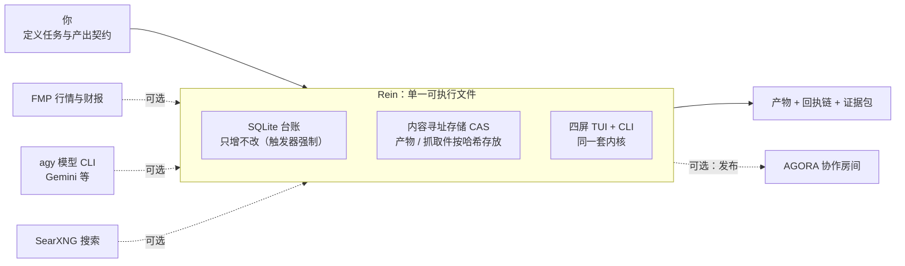
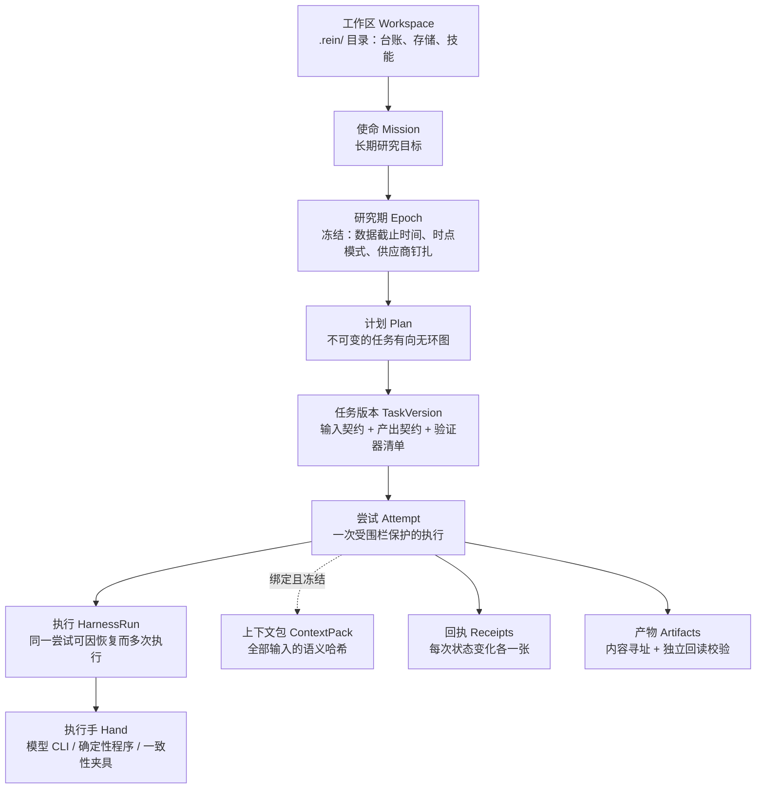
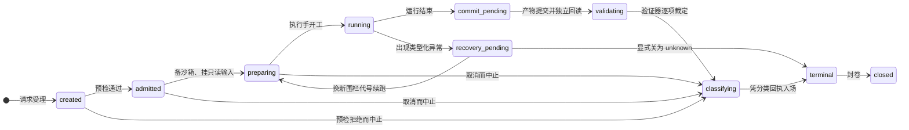
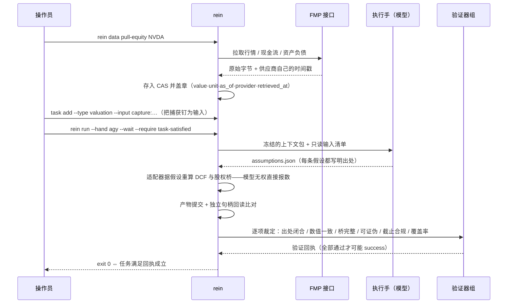
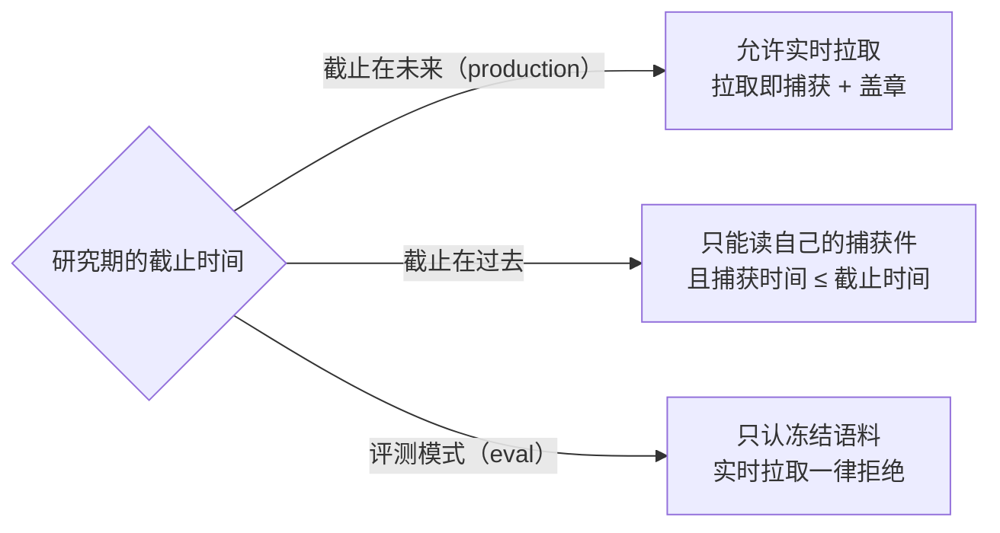
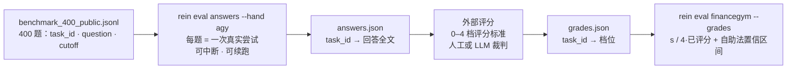

# Rein 入门：一个"证据优先"的金融研究工具

> **Rein**（缰绳）——缰绳套在一匹你租用其力气、却并不拥有的牲口身上。
> 你租用的是模型的推理能力；Rein 负责让这股力气**只在缰绳允许的范围内使劲，
> 并且每一步都留下可查验的凭据**。

Rein 是一个**独立的命令行 / 终端界面（CLI/TUI）应用**，用于做"有边界的"金融研究：
估值、研究报告、事实核验、预测结算、驱动因子监控。它是一个单一可执行文件，
不需要任何后台服务——账本用 SQLite（**只增不改**，由数据库触发器强制），
所有产物和抓取的网页放进一个按内容寻址的文件仓库，四屏 TUI 和 CLI 共用同一套内核。

一条命令就能说明它的脾气：

```sh
rein run task:dcf-nvda@1 --hand agy --wait --require task-satisfied
# 退出码 0 ⇔ 存在一张经过验证的"任务满足回执"——仅此而已，绝无捷径
```

---

## 一、它到底在解决什么问题

用模型做研究，会以普通流水线看不见的方式失败。四个真实的失败模式：

1. **绿灯空产出**：进程退出码是 0，模型信心满满地说"完成了"——但什么文件都没写。
   传统流水线看到 0 就放行；等你发现时，空结果已经被当作成功洗白了六个星期。
2. **引用了没人抓取过的网页**：报告里的 `[3]` 指向一个从未被保存的 URL。
   明天那个页面改版了，你的"证据"就蒸发了。
3. **凭空出现的 β**：一份 DCF 估值里躺着一个 1.15 的 beta——没人知道它从哪来。
   模型顺手编了一个，而它看起来太合理了，没人多问。
4. **昨天的 API 给不了昨天的数据**：做"时点回测"时向实时接口要历史数据，
   拿到的却是**今天修正过**的财报数字。没有任何查询参数能撤销一次财务重述。

Rein 对这四类失败的回答是**结构性的**——不靠自觉，靠合同、回执和验证器：

- 进程退出码和模型自述**只是证据，永远不是结论**；
- 报告里的每个引用必须解析到**已抓取并散列存档的字节**；
- 每个计算输入必须带上**出处**（一次数据抓取、一条已引用的论断、或一条写明理由的假设）——
  "裸浮点数"在数据结构上就**无法表示**；
- 过了截止时间的研究期**只能读自己当时的存档**，实时拉取会被直接拒绝，并说明原因。

---

## 二、全景：一台机器，几件可选外设



图里虚线的每一件都是**可选集成**：没配置时，相关功能会**拒绝并说明原因**，
而不是悄悄降级。离线状态下，确定性内核（含全部 93 个测试）照常运转。

---

## 三、核心概念：从"使命"到"回执"



几个关键词，用人话说：

- **研究期（Epoch）**：把"这批研究允许知道什么"冻结下来——数据截止时间、
  时点模式（实盘 / 评测）、外部依赖的版本钉扎。封印之后不可再改。
- **上下文包（ContextPack）**：一次尝试的全部输入打成一个包，算出语义哈希。
  **重试必须逐字节复用同一个包**；想改输入？那不叫重试，叫新的任务版本——
  界面会拒绝把它称为"重试"。
- **执行手（Hand）**：真正干活的东西。可以是真模型（经 `agy` CLI 调 Gemini 等），
  可以是零模型的确定性程序（`finance:deterministic`），也可以是专门用来演练
  失败场景的十个一致性夹具（`fake:exit0-empty`、`fake:hash-mismatch`……）。
  执行手是**执行绑定**而非语义内容——某只手挂了，换一只手在同一个上下文包上续跑，
  完全合法。
- **回执（Receipt）**：账本上的一行。状态变化、产物提交、验证裁定、终局分类、
  任务甄选……全部各有回执。**状态永远从账本重放得出，从不靠内存里的记忆。**

### "做完了"有六种说法，Rein 拒绝把它们合并成一个绿灯

| # | 说法 | 谁说了算 |
|---|------|----------|
| 1 | 进程跑完了 | 子进程退出码——**仅是证据** |
| 2 | 产物齐了 | 提交回执：内容寻址 + **由写入者不拥有的句柄独立回读** |
| 3 | 这次尝试成功了 | 分类器只看回执得出的终局结论（10 个值之一） |
| 4 | 任务满足了 | 一张**任务甄选回执**——成功的尝试自己不算数 |
| 5 | 研究被接受了 | 外部评审门（若接入）的采纳状态，如实转录 |
| 6 | 系统采纳了 | 更外层的联邦裁定——同样只转录，不代言 |

`unknown`（未知）永远保持未知：它绝不默认成任何东西，
而"行政强制成功"这个操作**在代码里不存在**——没有这个函数、没有这个子命令、
TUI 上没有这个按键。

---

## 四、一次尝试的一生



两条值得记住的规矩：

- **进 `terminal`（终局）只有一扇门**：账本里必须已经存在一张分类回执。
  超时的、被取消的运行也要走完"提交→验证→分类"——因为**捕获证据本身就是目的**。
- **恢复台只有三个安全动作**：换新围栏代号续跑（旧代号从此不得提交）、
  在同一个上下文包上重试（新尝试）、显式关为 unknown。第四个动作不存在。

---

## 五、六十秒上手（完全离线）

```sh
mkdir book && cd book
rein init                                  # 生成 .rein/ 布局 + 内置技能
rein mission create etf-book --objective "维护 ETF 持仓的估值"
rein epoch open 2026-08 --mission etf-book \
    --source-cutoff 2026-08-18T00:00:00Z --seal    # 冻结并封印研究期

cat > plan.yaml <<'EOF'
plan_ref: plan:demo@1
nodes:
  - task_ref: task:proof@1
    task_type: fixture
EOF
rein plan apply -f plan.yaml

rein run task:proof@1 --hand fake:deterministic-a \
    --wait --require task-satisfied        # 退出码 0 ⇔ 任务满足回执成立
rein replay attempt <尝试ID> --strict      # 重新执行、重新散列、逐项比对
rein attempt retry <尝试ID> --hand fake:deterministic-b
    # 同一个上下文包、下一个代际、换一只手——产物摘要必须逐字节一致
```

最后一行不是巧合，是**验收标准**：同一个冻结的上下文包经过两只不同的确定性手，
产出完全相同的产物摘要。整个内核里没有时钟、没有随机数，所以这条可以被证明。

---

## 六、真实场景：给 NVDA 做一次 DCF 估值

### 流程图



### 为什么把估值拆成两个文件

这是整套设计里最"金融"的一刀：

- **`assumptions.json`（假设清单）**——每个数字都是一个槽位
  `{名称, 数值, 单位, 出处, 状态}`。出处只有三种：一次数据捕获（带哈希）、
  一条已引用的论断、或一条**写明理由**的人为假设。它接受"研究类"验证器的审查。
- **`valuation.json`（估值算术）**——DCF、期末价值、EV→股权→每股的"桥"。
  它接受"数值类"验证器的审查，其中最狠的一条是 **numeric-consistency**：
  验证器**只用假设清单**从头重算一遍 DCF 和桥，数对不上就整单打回。

如果这两样东西混在一个文件里，模型就能把研究性的断言藏进"估值"里，
绕开引用验证器——所以拆开不是洁癖，是堵漏。

另外三条硬性要求：**EV→股权→每股的桥是必经之路**（一个止步于企业价值的 DCF
不是对一只股票的估值）；**敏感性表**至少覆盖期末增速、折现率、第一年自由现金流；
**至少一条可证伪条件**（"如果 X 日前数据中心收入增速低于 Y，此估值作废"）——
没有可证伪条件的结论不配进入决策。

### 真实数字（2026-08-19 实测）

同一批实时抓取的 NVDA 数据，两只手各跑一单，市场价 $218.15：

| 执行手 | 每股估值 | 相对市价 | 期末价值占比 |
|---|---|---|---|
| `finance:deterministic`（零模型，固定假设） | $73.67 | −66.2% | 74%（被标记提示） |
| `agy`（Gemini 3.7 Flash 出假设，引擎重算） | $106.80 | −51.0% | 79%（被标记提示） |

数字本身保守与否不是重点——重点是：每个输入都有出处、算术可被独立重算、
证据包校验通过、严格重放一致。**分歧摆在台面上，而不是藏在提示词里。**

顺带一提：模型第一次跑的时候没这么顺利。它把 JSON 包在 Markdown 代码块里、
私自尝试运行 Python、漏了可证伪条件——三次都被如实判为
`artifact_invalid` / `partial_success`，一次都没蒙混过关。这正是这套机器存在的意义。

---

## 七、时点完整性（PIT）：对"数据穿越"的硬约束



道理很简单也很残酷：**实时接口永远端出"今天版本"的数字**——财务重述、
盈利预测修订、指数成分调整，没有任何查询参数能撤销。所以过了截止时间的研究期，
唯一诚实的数据来源是你**当时**抓下来的字节。Rein 把这条做成了工具边界上的硬拒绝，
拒绝时会把这段道理原样打印给你。

每个数字入库时都带五个时间维度中适用的几个：事件时间、来源口径时间（as-of）、
抓取时间、创建/被取代时间、结算时间——**互不混用**。来源没有给出 as-of 的接口
（比如公司概况），会以"抓取时间"作为口径**并如实标注依据**，绝不冒充历史。

---

## 八、验证器：站在执行手够不着的那一侧

| 验证器 | 防的是什么 |
|---|---|
| `artifact-wellformed` | 声称是 JSON 的文件必须真的是 JSON，最小字节数达标 |
| `secret-scan` | 产物里出现密钥值 → 隔离（一张裁定 + 一张回执，产物永不入选） |
| `input-closure` | 幻觉出处：假设指向一个仓库里根本不存在的捕获哈希 |
| `numeric-consistency` | 估值必须能**仅凭假设清单**重算出来 |
| `bridge-completeness` | 每股数字必须来自 EV→股权→每股的桥 |
| `falsifier-present` | 没有可证伪条件 = 不可结算 = 不配进入决策 |
| `source-cutoff` | 引用的捕获必须在截止时间之内抓取 |
| `fact-vs-forecast` | 把截止时间之后的年份当"事实"陈述 → 打回（著名的"2027 断言"类） |
| `citation-closure` | 正文里的 `[N]` 必须解析到已存档字节；括号里的一个单词不算引用 |
| `coverage-denominator` | 覆盖率分母必须对得上：每一条被舍弃的输入都要写明原因 |
| `ops-discipline` | 核验/结算/监控产物必须能从钉住的输入重推出来 |

技能手册（`.rein/skills/*.md`）在冻结上下文包时把自己的验证器清单**并入任务契约**——
"只是好言相劝模型的手册等于文档"，真正的约束力在执行手管不到的这一侧。

---

## 九、证据包与重放：把"信我"换成"你自己验"

```text
nvda-dcf.evidence.tar.zst
└── evidence/
    ├── manifest.json        # 尝试引用、上下文哈希、回执清单
    ├── files.json           # 包内每个文件的 sha256 索引
    ├── context-pack.json    # 冻结的上下文包（可重新验封）
    ├── receipts.ndjsonl     # 完整回执链，可重放出状态
    ├── events.ndjsonl       # 执行手事件流（序号连续性可查）
    ├── providers.lock       # 供应商钉扎快照
    ├── artifacts/sha256-…   # 已提交产物的原始字节
    └── inputs/sha256-…      # 被钉住的输入的原始字节
```

`rein evidence verify` 会**确定性地**做完这些事：逐个文件重新散列并比对索引、
把上下文包重新验封、重放回执链检查连续性与终局一致性、
检查事件序号有没有缺口、确认每个已提交产物的字节都在包里且哈希为真。
包里任何一个字节被翻动，校验立刻变红。

`rein replay attempt --strict` 更进一步：对确定性执行手直接**重新执行一遍**，
重算产物摘要与原始记录比对——不一致就退出码 15。

---

## 十、TUI：四块屏幕

```sh
rein tui
```

| 屏 | 内容 |
|---|---|
| **1 · 指挥台** | 当前真相面板（研究期、截止时间、时点模式、providers.lock 哈希）；任务与其甄选状态；每个尝试的结论都**点名它出自哪张回执**（`success per rcpt_000123`） |
| **2 · 尝试实况** | 六种说法拆成六行并排——一次"绿灯空产出"在这里赤裸裸地自相矛盾：子进程退出 0 · 产物缺失 2 · 结论 artifact_invalid。组织性的那句话常驻屏上："进程退出只是证据。终局分类要等全部必要验证器。" |
| **3 · 恢复台** | 类型化异常队列 + 诊断；三个动作各自需要 y/n 确认——**改变权威的操作绝不单键触发**；"强制成功"没有按键 |
| **4 · 对比屏** | 两次尝试并排，差异分入六类：环境性 / 非语义回执 / 语义输入 / 产出 / 策略 / 未解释 |

键位：`?` 帮助 · `:` 命令板 · `g`+`1–4` 跳屏 · `j/k` 移动 · `a`/`b` 圈定对比对 ·
`F2` 鼠标捕获 · `Esc` 逐层退出（弹窗 → 选择 → 退出程序）。
已定案的证据面板用双线边框标 `[committed]`，实时读数用单线标 `[live]`——
**空面板会用文字说明自己为什么空**：空着和坏了是两回事。

---

## 十一、评测：从公开题库到分数（分数永远碰不到结论）

### 跑一遍真实的 FinanceGym 基准

公开发布的 400 题集**只有题目**——每行仅 `{task_id, question, cutoff}`，
没有标准答案，也没有机器可查的评分点。完整流程分三步：



**第一步：批量作答。**

```sh
rein eval answers -f benchmark_400_public.jsonl --hand agy --out fg-answers.json
# 分片跑也行：--limit 50 --offset 50
```

每道题都不是"松散地调一次模型"：题目本身先被钉成捕获件，生成一个
`answer` 类型的任务，走完整条流水线——回执、密钥扫描、诚实分类。
两个在 400 题规模上真正值钱的性质：

- **可续跑**：答没答完记在甄选回执上，Ctrl-C 中断后重跑同一条命令，
  已答的题直接跳过（输出里写明 `resumed: N`），失败的题被如实列出并在下次重试。
- **每个回答都可审计**：`rein attempt list` 能看到它，`rein evidence bundle`
  能把它连同回执链打包。

实测参考：经 agy 走 Gemini，每题约 1–2 分钟——全量 400 题是一个
7–13 小时的后台活，所以续跑不是锦上添花，是刚需。
（`--hand finance:ops` 只输出自我声明的占位答案，仅供管线测试，不可用于真实基准。）

**第二步：评分。** 逐题按 0–4 档评分标准打分——人工或 LLM 裁判——
存成 `grades.json`（`{"<task_id>": 0..4, …}`）。

**第三步：汇总。**

```sh
rein eval financegym -f benchmark_400_public.jsonl --grades grades.json
```

输出 s/(4·已评分) 与自助法 95% 置信区间（随机种子来自题目 ID，
**同一份输入永远给出同一个区间**）。一条诚实规则贯穿始终：
**没有评分依据的题记为"未评分"，绝不折算成零分**——把 400 道机器判不了的题
按 0 分计入，等于凭空捏造一个统计量；直接跑原始题库会得到
`graded: 0, score: null` 和一段把这个道理讲清楚的警告。

### 内部轨道：用自己的结算给执行手排名

`rein eval internal` 用**你自己已结算的估值**给各只执行手排名：
结算行通过 `rein:attempt_…` 关联键找回当初出这单估值的手。
继承来的证据**在结构上就无法计入分数**，只能列在旁边——直接与继承，永不相加。

两条轨道共同的铁律：评分只读产物、不写任何回执、对任何终局结论零影响。
"永远不要让基准分数或模型的漂亮话来判定运行时的成败。"

---

## 十二、配置速查

密钥住在 `configRoot`（默认 `~/.config/rein/`），**永远不进工作区**——
一个可能被模型输出或网络同步写到的目录不配存放凭据，这条是硬拒绝而非建议。

```toml
# ~/.config/rein/config.toml            # ~/.config/rein/secrets.toml
default_hand = "finance:deterministic"  # fmp    = "…"
searxng_url  = "http://localhost:8080"  # <名字> = "…"  → secret-ref:<名字>
fmp_env_file = "/path/to/.env"          # （或直接 export FMP_API_KEY）
agy_path     = "agy"
agy_model    = "gemini-3.7-flash-low"
agora_key_path = "~/.agora/rein-party-key"
```

工作区布局（`.rein/`）：`workspace.yaml` · `providers.lock` · `policies/` ·
`plans/` · `skills/` · `ledger.db` · `objects/`（CAS）· `cache/` · `logs/` · `tmp/`。

所有命令都支持 `--output table|json|yaml|ndjson`；标准输出只放机器可读的信封
（`rein.cli-result/v1`），诊断走标准错误；`ok` 的定义严格等于"退出码为 0"。
**不带 `--wait` 时，退出码 0 只表示"已受理并跑完"，对结果不做任何断言**——
信封的警告栏会把这句话原样告诉你。

---

## 十三、故意不做的事

每一条都写明了"什么时候才做"，防的是"造好了、测过了、从没接线，却被当作保障引用"：

| 不做 | 何时再做 |
|---|---|
| 租约服务（并发围栏） | 出现第二个并发工作者时 |
| 多租户 / 远程执行 | 永不进这个二进制；集群形态是另一个更小的产品 |
| 容器级沙箱 | 跨机执行出现时 |
| 插件 PKI 签名 | 有了分发渠道再说（本地工具诚实的上限是首次信任钉扎） |
| `backtest` 回测 | 缺少无幸存者偏差的价格序列底座——宁可声明缺席，不半吊子上线 |

---

## 附：术语对照

| 中文 | 英文 | 一句话 |
|---|---|---|
| 执行手 | Hand | 干活的：模型 CLI、确定性程序或测试夹具 |
| 尝试 | Attempt | 一次受围栏保护的执行，关卷后不可变 |
| 上下文包 | ContextPack | 冻结的全部输入，语义哈希是它的身份 |
| 回执 | Receipt | 账本上的一行；一切判断的唯一依据 |
| 研究期 | Epoch | 冻结的研究窗口：截止时间 + 时点模式 |
| 捕获件 | Capture | 抓下来并盖了五维时间戳的原始字节 |
| 可证伪条件 | Falsifier | "什么情况下这个结论作废" |
| 围栏代号 | Fence generation | 恢复时换新号；旧号不得再提交 |
| 证据包 | Evidence bundle | 自包含、可独立校验的 tar.zst |
| 覆盖率分母 | Coverage denominator | 该数的都数了，弃掉的都写了原因 |
| 结算 | Settle | 到期估值对照实现价：证实 / 证伪 / 到期未观测 |
| 评审门 | Gate | 外部裁定处；Rein 只提案，永不代批 |

---

*仓库内更多材料：`README.md`（英文总览）· `docs/INVARIANTS.md`（33 条不变量 →
生产符号 → 变红测试，33/33 绿）。完整设计文档（v0.2）属内部材料，不随仓库分发。*
