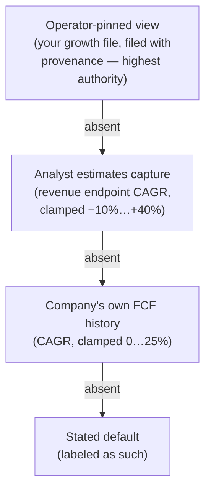
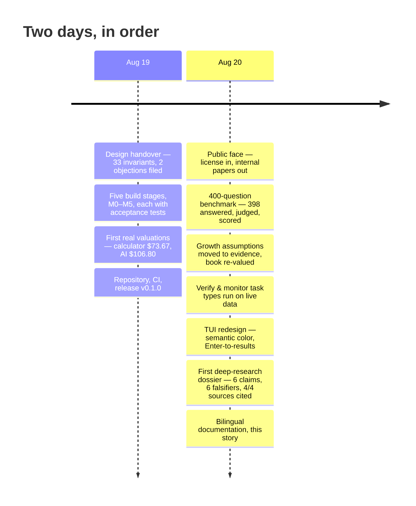
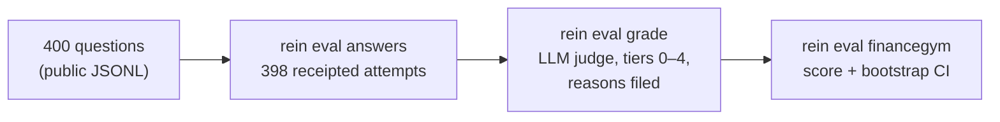

# The Rein Story — a complete introduction

**English** · [简体中文](STORY.zh-CN.md)

*A self-contained introduction to what Rein is, how it works, and what it
has done so far — written to be readable without a technical background,
and precise enough to be worth a professional's time. The terse reference
is the [README](../README.md); the illustrated deep-dive in Chinese is
[INTRO.zh-CN.md](INTRO.zh-CN.md).*

---

## 1 · The problem: brilliant assistants, unaccountable work

AI models are becoming genuinely useful research assistants — fast,
tireless, and articulate. In financial research, however, the failure
modes are exactly the ones ordinary software never had to guard against:

- **The empty success.** A process finishes with exit code 0 — the
  universal "all good" — having produced *nothing*. A pipeline that
  trusts exit codes files an empty folder as a win.
- **The phantom citation.** A confident summary cites "[3]" — but no
  page numbered 3 was ever fetched. The bracketed number *looks* like
  evidence and is only typography.
- **The invented number.** A valuation rests on a growth rate or beta
  the model produced from nowhere. It is plausible, well-formatted, and
  unfounded.
- **The quietly rewritten past.** A "point-in-time" backtest asks a data
  vendor for 2024 figures — and receives today's *restated* versions of
  them. Nothing in the reply says so.

None of these are fixed by making the model smarter, because none of
them are intelligence failures. They are *accountability* failures. Rein
— the word for the harness on an animal whose strength you rent but do
not own — is a structural answer: a runtime that makes sloppy work
**unrepresentable, or at least unmistakable**, regardless of how the
model behaves.

## 2 · What Rein is

Rein is a single-binary command-line and terminal-UI tool. You declare a
research **task** with an explicit output contract ("produce
`valuation.json` and `assumptions.json`; they must survive these eleven
validators"). A **hand** — a real AI model, a deterministic calculator,
or a test fixture — executes one **attempt** inside a fence. Rein
records everything, validates the artifacts, and classifies the outcome
**from receipts only** — never from exit codes, never from the model's
own account of itself.

```mermaid
flowchart LR
    OP["You<br/>declare a task +<br/>output contract"] --> PACK["Context pack<br/>(inputs pinned &amp; hashed,<br/>then frozen)"]
    PACK --> HAND["A hand runs<br/>one attempt<br/>(model / calculator / fixture)"]
    HAND --> CAP["Everything captured:<br/>stdout, stderr, files"]
    CAP --> CAS["Content-addressed store<br/>(bytes filed by hash)"]
    CAS --> VAL["Validators<br/>(11 automated inspectors)"]
    VAL --> CLS["Classifier reads receipts,<br/>never exit codes"]
    CLS --> LEDGER["Append-only ledger<br/>(receipts, in ink)"]
    LEDGER --> YOU["You: verify, replay,<br/>or challenge any claim"]
```



Five properties carry the design:

1. **Receipts, not claims.** Every number arrives stamped — value, unit,
   as-of date, provider, retrieval time — or it cannot be written down
   at all. Assumptions are legal inputs, but only with a stated
   justification; a bare float is unrepresentable in the schemas.
2. **An append-only ledger.** Every step of every attempt becomes a
   receipt in a database that enforces — at the database layer — that
   rows can never be updated or deleted. The program that owns the file
   cannot rewrite its own history.
3. **Honest classification.** Outcomes come from a closed vocabulary
   (`success`, `partial_success`, `failure`, `artifact_invalid`,
   `unknown`, …). `success` must be earned: every required artifact
   committed *and independently read back*, every mandatory validator
   passed. `unknown` never defaults to anything else, and no
   force-success operation exists — not as a function, a command, or a
   keybinding. Tests assert its absence.
4. **Point-in-time discipline.** A task carries a knowledge cutoff.
   Under a past cutoff, live data pulls are refused outright — because a
   vendor's API serves the present, and no query parameter can un-restate
   a restated figure.
5. **Replayability.** The same frozen input pack through two
   deterministic hands must produce byte-identical artifacts, and
   `rein replay --strict` re-executes and re-hashes an attempt to prove
   nothing drifted. A single tampered byte turns verification red.

### Six questions, never one badge

Most dashboards compress a run into one green or red light. Rein refuses:
it tracks six separate questions, each answered by its own evidence, and
displays them side by side.

| Question | Example answer |
|---|---|
| Did the process finish? | `exit 0` |
| Are the artifacts there? | `missing: 2` |
| What did validators say? | `0 verdicts recorded` |
| What was the outcome? | `artifact_invalid (required_artifact_absent)` |
| Is the task satisfied? | `unsatisfied` |
| Was it accepted externally? | `not adjudicated here` |

The row above is a real pattern — a "green but empty" run. On one badge
it would average into a lie. On six fields the contradiction is the
first thing you see.

## 3 · A worked example: valuing a company

This is the actual flow used in the demo book (`rein-book`), condensed.

```sh
# 1. Pull live market data — every row lands stamped in the store.
rein data pull-equity NVDA --kinds quote,cashflow,balance,estimates

# 2. Declare the task: a valuation over those exact pinned inputs.
rein task add task:dcf-nvda@2 --plan plan:book@1 --type valuation \
    --universe security:nvda \
    --input capture:sha256:3f46cf… --input capture:sha256:196f72… \
    --input capture:sha256:1c122d… --input capture:sha256:f9ce1f…

# 3. Run it, and demand proof — exit 0 if and only if a verified
#    task-satisfaction receipt exists.
rein run task:dcf-nvda@2 --hand finance:deterministic \
    --wait --require task-satisfied
```

The output contract splits the deliverable in two, on purpose.
`assumptions.json` carries every input with its provenance — here is one
slot from the real artifact, abridged:

```json
{
  "name": "fcf_y2",
  "value": 141650000000.0,
  "unit": "ccy",
  "basis": {
    "kind": "assumption",
    "justification": "year-2 FCF at growth 0.2128: analyst revenueAvg
      endpoint CAGR 0.2128/y over 4 forward periods (capture sha256:f9ce1f…),
      clamped [-0.10, 0.40], held flat across the window
      (FCF-growth proxy stated)"
  },
  "status": "filled"
}
```

Note what that one entry contains: the number, its derivation formula,
the clamp applied to it, and the fingerprint of the analyst-estimates
snapshot it came from. `valuation.json` then carries the arithmetic —
and a validator recomputes the whole discounted-cash-flow from the
assumptions file alone; if the two disagree, the run fails.

The current demo book, valued this way (August 20, 2026):

| Company | Rein per-share | Market | Growth input used |
|---|---|---|---|
| NVIDIA | $124.71 | $217.56 | analyst revenue CAGR, 21.3%/yr |
| Microsoft | $288.11 | $484.31 | analyst revenue CAGR, 23.1%/yr |
| Apple | $121.47 | $316.83 | analyst revenue CAGR, 8.5%/yr |
| Alphabet | $149.40 | $344.72 | analyst revenue CAGR, 15.6%/yr |
| Amazon | $10.14 | $265.84 | analyst revenue CAGR, 13.2%/yr |

The gaps to market are the *honest* output of a deliberately simple
model: trailing free-cash-flow base, a 9.5% discount rate, terminal
growth of 2.5% — all stated, all overridable. (Amazon is the extreme
case: its trailing FCF is depressed by heavy reinvestment, and a
trailing-FCF DCF says so rather than flattering it.) Where does growth
come from? A strict order of trust:



Every year of the forecast records which rung of that ladder it came
from, and the receipt behind it.

## 4 · The chronicle



### Day one — August 19, 2026

**A design arrives, and two objections.** Rein began not with code but
with a hand-over: a finished design of thirty-three numbered invariants
— rules the software must never break — five build milestones each with
acceptance tests, and *tear-down clauses*: pre-agreed conditions under
which a feature must be removed again. (One is still armed: if the tool
ever accumulates too many unexplained `unknown` outcomes in a trailing
window, that subsystem is judged failed.) Before implementation, two
objections to edge-case rules were argued and recorded in the project's
permanent log, with reasons. Both were accepted. Every deviation from
the design since has been recorded the same way.

**Five stages, one day.** The contracts and outcome vocabulary; the
append-only ledger with byte-identical replay proven by test; the
finance layer (stamped data pulls, recomputable valuation arithmetic,
eleven validators); the recovery console — exactly three safe actions
for stuck runs, with "mark as success" structurally absent; and the
four-screen terminal dashboard.

**First real numbers — and three honest failures.** The deterministic
calculator valued NVIDIA at **$73.67** against a ~$218 market price,
stating exactly why it was conservative. Then a real AI model attempted
the same task and failed three times in a row, each failure classified
and filed: first for wrapping its output in formatting the strict parser
rejects; then for attempting to run programs it had no permission to
run; then for omitting the required falsifier — the "what would prove
me wrong" clause every valuation must carry. Its fourth attempt —
**$106.80** — passed all eleven validators and became the first
AI-authored valuation Rein accepted. The afternoon also produced a
characteristic small fix: the live quote lacked a share count, so one
was derived from market cap ÷ price — *citing the same capture*, because
even workarounds carry receipts.

**By evening**: a repository with continuous integration re-proving the
whole system on every change, a README, and release v0.1.0. The day's
evidence bundles — self-verifying archives of every receipt and artifact
— were published to the project's coordination room by the binary
itself.

### Day two — August 20, 2026

**A public face.** Internal working papers moved out of the repository;
a dual open-source license (MIT or Apache-2.0, at your option) moved in;
and the build was reduced to depend on nothing but publicly published
components — a fresh clone builds anywhere, for anyone.

**The 400-question benchmark.** Overnight, the AI assistant answered a
public benchmark of 400 financial research questions as 400 independent,
receipted attempts — resumable at any point, which mattered across an
eleven-hour run. It answered **398**; two questions produced empty
output on every retry and stand in the ledger as honest failures rather
than bluffs. A newly built grading command then had a judge model score
every answer against a five-tier rubric, with each grade's reasoning
filed:



Headline: **99.4%** (95% CI 98.5–100). Rein's honesty rules apply to its
own report card, so three qualifications are filed next to the number.
*First*, the judge is from the same model family as the student and had
no answer key — the score is an upper bound, not a result. *Second*, the
official benchmark protocol grades against per-question rubric items
that are deliberately withheld from participants; only maintainer-run
grading produces leaderboard-comparable numbers. *Third*, the judge did
demonstrate real discrimination: it caught an answer that accepted a
trick question's false premise, one that cited information from after
its knowledge cutoff, and one that transposed years — tiers 0, 0, and 2
respectively, reasons on file.

**Valuations moved to evidence.** The operator ruled the old flat growth
guess too timid to mean anything, and growth became a provenance-ordered
input (the ladder diagrammed above). Getting there surfaced two genuine
data traps, now documented and defended: a company's cash-flow *history*
can measure capital-spending timing rather than growth, and far-year
analyst *averages* sag simply because fewer analysts publish that far
out. The whole book was re-valued the same day.

**Two new task types ran for real.** A **verify** task had a second,
different worker challenge the AI's NVIDIA valuation; its verdict —
`inconclusive`, with the exact evidence that would settle the claim
attached — is what an honest challenger without new evidence *should*
say. A **monitor** task watched two days of price data and correctly
reported *zero* changed values: the new day's price is an inserted row,
not a revision of the past. Its silence is the feature — it exists to
shout only when history is quietly rewritten:

```json
{ "moved": [], "inserted": [ { "as_of": "2026-08-20", "value": 217.56 } ] }
```

**The control room grew up.** Semantic color (green verified-good, red
failed, yellow degraded, `unknown` a deliberately loud purple), a tab
bar and per-screen key bar, a live activity spinner — and the largest
usability change: pressing **Enter** on any attempt opens its actual
results in place, read back from the content-addressed store, so the
screen can only display what was genuinely filed.

**A deep-research dossier, end to end.** The research task type is the
strictest contract in the harness: a markdown dossier whose every inline
`[N]` must resolve — through a claims file — to the *bytes* of a real
captured source ("a word in brackets is not a citation"), plus a claims
register where facts carry evidence and forecasts carry falsifiers, and
a coverage ledger where consumed + withheld sources must equal the
sources given. The model hand learned this contract with one structural
safeguard: **the model never writes a digest**. It cites numbered
sources it was given; the adapter maps each number onto the pinned
capture's real fingerprint, so a citation can only point at evidence
that exists — an invented `[9]` gets no entry and fails validation
honestly.

The first real run — NVIDIA, over four pinned captures (quote,
cash-flow statement, balance sheet, analyst estimates) — passed the
whole gauntlet on its first attempt: a dossier citing all four sources
(coverage **4 consumed + 0 withheld = 4 eligible**), six load-bearing
claims — four facts, two forecasts — each with a genuine falsifier:

> *"NVIDIA generated $102.72 billion in net cash from operating
> activities and $96.68 billion in free cash flow [2]…"* — falsifier:
> *restated or amended 10-K cash-flow statements showing different
> figures.*
>
> *"Consensus forecasts project revenue reaching ~$563.6B (FY2028)…"* —
> marked **forecast**, falsifier: *actual reported FY2028 revenue below
> the projected consensus.*

The evidence bundle for the run verifies, like every other.

**The harness studied a sibling and learned staging** — and then spent
five runs teaching one of its own rules to read analyst prose. The
operator handed over a working research application to learn from; its
method (plan first, investigate per section, synthesize with positions)
became an editable skill document, and the research hand became a staged
pipeline with one safeguard the original never had: the model cites
numbered sources and *never writes a source fingerprint itself*. The
first staged run over ten sources — four earnings-call transcripts among
them — produced by far the best dossier yet, and failed validation.
So did the next three, each on the same rule, each on a *different
legitimate sentence*: a reported fiscal quarter (fiscal years run ahead
of the calendar), a cited statement of management's own roadmap, and
finally the falsifier line itself — the most honest sentence in the
document. Four failures, four honest classifications, one structural
lesson: the deadly form of a future-claim is the *unfalsifiable* one, so
the recorded rule became "unmarked and uncited fails; a cited line
answers to its source." The fifth run passed everything. All four
failed dossiers remain in the ledger with their reasons — the record of
a rule being taught is itself evidence.

**And the library learned to grow itself — under supervision.** A run's
receipts can now be distilled into a *draft* playbook (`rein skill new`),
a deterministic gate checks it (one-sentence description, only registered
validators, a body that states how its own output could fail), and only
the operator's explicit `promote` puts it in force. The first generated
draft came from the book's own recorded caveat: a bank-valuation method
distilled from the JPM attempt, correctly insisting that for banks debt
is raw material and valuation belongs at the equity level. It sits in
drafts, valid, awaiting promotion — which is the whole point.

**And a library grew.** The playbooks stopped being code and became
fourteen reviewable documents — how to value, verify, settle, monitor,
answer, review an earnings print, map risks so they can actually be
watched, and write the one-sentence falsifiable thesis — each carrying
the failure modes that cost a real run.

**And this document** — in two languages, with its diagrams.

## 5 · The invariants that do not move

Six commitments hold regardless of how the project grows, each guarded
by automated tests that fail if it is ever violated:

1. **No force-success exists** — not a function, not a command, not a
   key. The keymap is a closed list, and a test asserts nothing in it
   can spell the forbidden action.
2. **`unknown` never becomes anything else** without an explicit,
   recorded human decision.
3. **Every number carries a receipt; every status names its proof** —
   down to the receipt identifier on the dashboard's outcome cells.
4. **The ledger is append-only.** The past cannot be rewritten, by
   anyone, including the software itself.
5. **Absence is stated, never blank.** An empty panel says what its
   emptiness means.
6. **Scores never touch outcomes.** A benchmark grade, however good,
   cannot promote an attempt's classification — evaluation reads
   artifacts and writes nothing.

---

*To go deeper: the [README](../README.md) is the operational reference;
[INVARIANTS.md](INVARIANTS.md) maps all thirty-three invariants to the
code and tests that enforce them; [INTRO.zh-CN.md](INTRO.zh-CN.md) is an
illustrated long-form introduction in Chinese.*
