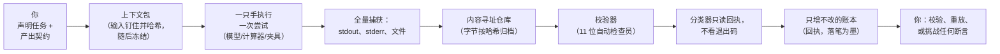
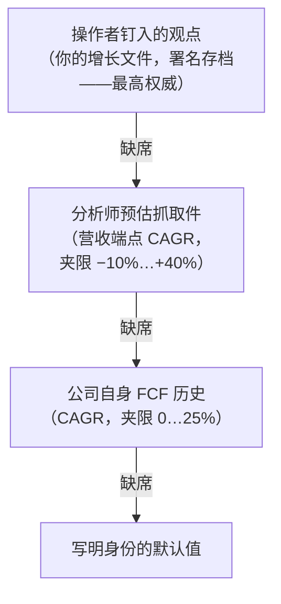
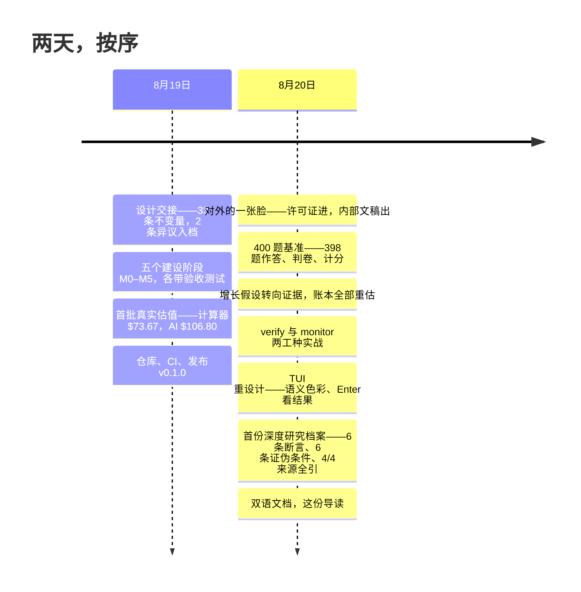
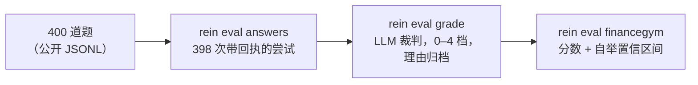

# Rein 的故事——一份完整导读

[English](STORY.md) · **简体中文**

*一份自成一体的导读：Rein 是什么、如何工作、到目前为止做成了什么——
不需要技术背景也能读懂，同时足够严谨、值得专业读者的时间。速查参考
是 [README](../README.zh-CN.md)；配图深读是
[INTRO.zh-CN.md](INTRO.zh-CN.md)。*

---

## 1 · 问题：聪明的助手，无从问责的工作

AI 模型正在成为真正有用的研究助手——快、不知疲倦、文笔流畅。但在
金融研究里，它的失败方式恰恰是传统软件从未防备过的那几种：

- **空手的"成功"。** 进程以退出码 0 结束——计算机世界通用的"一切
  正常"——却什么都没产出。一条只信退出码的流水线，会把空文件夹
  归档成胜利。
- **幽灵引用。** 一段自信的摘要写着"[3]"——但从来没有抓取过编号 3
  的那一页。方括号里的数字*看起来*像证据，实际只是排版。
- **凭空的数字。** 一份估值建立在模型不知从哪来的增长率或 beta 上。
  它合理、工整、且毫无根据。
- **被悄悄改写的过去。** 一次"时点"回测向数据商要 2024 年的数字——
  拿到的却是*今天重述过*的版本。回复里没有任何一个字提示这一点。

这些问题没有一个能靠"让模型更聪明"解决，因为它们都不是智力问题，
而是**问责**问题。Rein——这个词的本意是套在一头你租用其力气、却并
不拥有它的牲口身上的缰绳——给出的是结构性回答：一个让糊弄的工作
**要么无法表示、要么无法藏身**的运行时，无论模型自己怎么表现。

## 2 · Rein 是什么

Rein 是单一二进制的命令行 + 终端界面工具。你声明一个研究**任务**和
明确的产出契约（"产出 `valuation.json` 与 `assumptions.json`，并
通过这十一道校验"）。一只**手**——真正的 AI 模型、确定性计算器、
或测试夹具——在围栏内执行一次**尝试**。Rein 记录一切、校验工件，
并且**只凭回执**分类结果——绝不看退出码，绝不听模型的自述。



五条性质撑起整个设计：

1. **凭据，而非声称。** 每个数字带戳到场——数值、单位、时点、供应
   商、抓取时间——否则根本写不进去。假设是合法输入，但必须写明
   理由；裸浮点数在数据结构上就无法表示。
2. **只增不改的账本。** 每次尝试的每一步都成为一张回执，存进一个
   在数据库层强制"不可更新、不可删除"的账本。连拥有这个文件的
   程序也改写不了自己的历史。
3. **诚实分类。** 结果来自封闭词表（`success`、`partial_success`、
   `failure`、`artifact_invalid`、`unknown`……）。`success` 要挣：
   每个必需工件提交*并经独立读回*，每道强制校验通过。`unknown`
   永不默认成别的东西；force-success 不存在——不是函数、不是命令、
   也不是按键，且有测试断言它的缺席。
4. **时点纪律。** 任务携带知识截止日。截止日在过去时，线上拉数被
   直接拒绝——因为数据商的接口只供应"现在"，任何查询参数都无法
   撤销一次重述。
5. **可重放。** 同一份冻结输入包经两只确定性手，产出必须逐字节
   相同；`rein replay --strict` 重跑并重哈希一次尝试，证明没有任何
   漂移。一个被篡改的字节就能让校验变红。

### 六个问题，绝不合并成一枚徽章

多数仪表盘把一次运行压缩成一盏红绿灯。Rein 拒绝：它追踪六个独立的
问题，各自由各自的证据回答，并排展示。

| 问题 | 示例回答 |
|---|---|
| 进程跑完了吗？ | `exit 0` |
| 工件在吗？ | `missing: 2` |
| 校验器怎么说？ | `0 条裁定` |
| 结果是什么？ | `artifact_invalid（必需工件缺失）` |
| 任务满足了吗？ | `unsatisfied` |
| 外部接受了吗？ | `此处未裁定` |

上面这一行是真实出现过的模式——"绿色但空手"。压成一枚徽章，它会
被平均成谎言；摊成六个字段，矛盾是你第一眼看到的东西。

## 3 · 完整示例：给一家公司估值

以下是演示账本（`rein-book`）里的真实流程，略作压缩。

```sh
# 1. 拉取实时行情——每一行带戳落库。
rein data pull-equity NVDA --kinds quote,cashflow,balance,estimates

# 2. 声明任务：一份只针对这些钉定输入的估值。
rein task add task:dcf-nvda@2 --plan plan:book@1 --type valuation \
    --universe security:nvda \
    --input capture:sha256:3f46cf… --input capture:sha256:196f72… \
    --input capture:sha256:1c122d… --input capture:sha256:f9ce1f…

# 3. 运行并索要证明——当且仅当存在一张经校验的任务满足回执，
#    退出码才是 0。
rein run task:dcf-nvda@2 --hand finance:deterministic \
    --wait --require task-satisfied
```

产出契约刻意一分为二。`assumptions.json` 携带每个输入及其出处——
这是真实工件里的一个槽位，略有删节：

```json
{
  "name": "fcf_y2",
  "value": 141650000000.0,
  "unit": "ccy",
  "basis": {
    "kind": "assumption",
    "justification": "第 2 年 FCF，增速 0.2128：分析师 revenueAvg
      端点 CAGR 0.2128/年，取自 4 个前瞻期（抓取件 sha256:f9ce1f…），
      夹限 [-0.10, 0.40]，窗口内持平（作为 FCF 增速代理，已声明）"
  },
  "status": "filled"
}
```

注意这一个条目里装了什么：数字本身、推导公式、施加的夹限、以及它
所依据的分析师预估快照的指纹。随后 `valuation.json` 承载算术——
一道校验器会仅凭假设文件重算整个 DCF；两边对不上，这次运行就失败。

演示账本按此方式估出的现值（2026 年 8 月 20 日）：

| 公司 | Rein 每股 | 市价 | 所用增长输入 |
|---|---|---|---|
| 英伟达 | $124.71 | $217.56 | 分析师营收 CAGR，21.3%/年 |
| 微软 | $288.11 | $484.31 | 分析师营收 CAGR，23.1%/年 |
| 苹果 | $121.47 | $316.83 | 分析师营收 CAGR，8.5%/年 |
| Alphabet | $149.40 | $344.72 | 分析师营收 CAGR，15.6%/年 |
| 亚马逊 | $10.14 | $265.84 | 分析师营收 CAGR，13.2%/年 |

与市价的差距是一个刻意简单的模型的*诚实*产出：以过去十二个月自由
现金流为基数、9.5% 贴现率、2.5% 终值增速——全部写明、全部可覆盖。
（亚马逊是极端案例：重投入压低了它的当期自由现金流，一个以此为基
的 DCF 就该照实说，而不是替它涂脂抹粉。）增长率从哪来？一条严格的
信任阶梯：



预测中的每一年都记录自己来自阶梯的哪一级，以及背后的凭据。

## 4 · 编年史



### 第一天——2026 年 8 月 19 日

**设计送达，外加两条异议。** Rein 不是从代码开始的，而是从一次交接
开始的：一份写完的设计——三十三条编号的不变量（软件永远不许违反的
规则）、五个各带验收测试的建设里程碑，还有*拆除条款*：预先约定的
"什么情况下这个功能必须拆掉"。（其中一条至今待命：如果滚动窗口内
无法解释的 `unknown` 结果积累过多，该子系统即判定失败。）动工之前，
两条针对边角规则的异议连同理由写进了项目的永久日志，均被采纳。此后
每一次对设计文本的偏离，都以同样的方式记录在案。

**五个阶段，一天建成。** 契约与结果词表；由测试证明可逐字节重放的
只增不改账本；金融层（带戳拉数、可重算的估值算术、十一道校验）；
救援台——卡住的运行只有恰好三个安全动作，"标为成功"在结构上就
不存在；以及四屏终端仪表盘。

**第一批真实数字——和三次诚实的失败。** 确定性计算器给英伟达估出
**73.67 美元**（市价约 218 美元），并写明保守在哪里。随后真正的 AI
模型考同一道题，连挂三次，每次失败都分类归档：第一次，它把输出裹进
严格解析器拒收的格式；第二次，它试图运行无权运行的程序；第三次，
它漏掉了必填的证伪条款——每份估值都必须携带的那句"什么能证明我
错了"。它的第四次尝试——**106.80 美元**——通过全部十一道校验，
成为 Rein 接受的第一份 AI 撰写的估值。当天下午还有一个很有性格的
小修复：实时报价缺股本数，就用市值 ÷ 股价推导——*引用同一张抓取
件*，因为连变通方案也要带凭据。

**到傍晚**：仓库就位，持续集成在每次改动时重新证明整套系统，README
写好，发布 v0.1.0。当天的证据包——能自我校验的回执与工件封存档——
由这个二进制*亲自*发布到项目的协调房间。

### 第二天——2026 年 8 月 20 日

**对外的一张脸。** 内部工作文稿搬出仓库；双开源许可（MIT 或
Apache-2.0，任选）放进来；整个构建被瘦身到只依赖公开发行的部件——
任何人在任何机器上拉一份全新副本都能构建。

**400 题基准。** 一夜之间，AI 助手把一套公开金融研究基准的 400 道题
答成 400 次独立的、带回执的尝试——随时可中断续跑，这在十一小时的
长跑里至关重要。它答出 **398** 道；两道题每次重试都产出空白，作为
诚实的失败躺在账本里，而不是硬凑。随后，新造的判卷命令让一个裁判
模型按五档评分标准逐题打分，每个分数的理由归档：



表面分数：**99.4%**（95% 置信区间 98.5–100）。Rein 的诚实规矩同样
适用于自己的成绩单，所以数字旁边归档着三条限定。*其一*，裁判与考生
同属一个模型家族，且没有答案钥匙——这个分数是上限，不是成绩。
*其二*，官方基准的评分依据是对参与者刻意保密的逐题评分条目，只有
主办方运行的判卷才产生可上榜的可比数字。*其三*，裁判确实展示了
分辨力：它抓住了一份顺着陷阱题虚假前提编下去的回答、一份引用了
知识截止日之后信息的回答、一份年份张冠李戴的分析——分别判 0、0、
2 档，理由在案。

**估值转向证据。** 操作者裁定旧的平坦增长猜测"保守到没有意义"，
增长率于是变成按出处排序的输入（即上文那条阶梯）。落实途中挖出两个
真实的数据陷阱，如今都有文档、有防御：公司的现金流*历史*量的可能是
资本开支的节奏而非增长；远期年份的分析师*均值*会下凹，只因敢报那么
远的分析师变少。当天整本账全部重估。

**两个新工种实战。** 一次 **verify（核证）** 任务让另一名不同的工人
挑战 AI 的英伟达估值；它的裁定——`inconclusive（证据不足以定论）`，
并附上"什么证据能定论"——正是一个没有新证据的诚实挑战者*应该*说
的话。一次 **monitor（哨兵）** 任务盯了两天价格数据，正确地报告
*零个*被改动的值：新一天的价格是新插入的行，不是对过去的修订。
它的沉默正是功能本身——它存在的意义，是只在历史被悄悄改写时呼喊：

```json
{ "moved": [], "inserted": [ { "as_of": "2026-08-20", "value": 217.56 } ] }
```

**控制室长大了。** 语义色彩（绿=验证过的好，红=失败，黄=打折，
`unknown` 是刻意刺眼的紫）、标签栏与分屏按键栏、实时活动指示器——
以及最大的可用性变化：在任何一次尝试上按 **Enter**，它的真实成果
就地展开，从内容寻址仓库读回，屏幕只能展示真正归档过的东西。

**一次端到端的深度研究。** research（研究）是整套框架里最严苛的
契约：一份 markdown 档案，正文里每个 `[N]` 都必须经由断言文件解析到
一份真实抓取来源的*字节*（"方括号里的词不是引用"）；一份断言登记
册，事实必须带证据、预测必须带证伪条件；还有一本覆盖率台账，已引用
+ 已搁置的来源数必须恰好等于给定的来源数。模型手学会这份契约时带着
一道结构性保险：**模型永远不写摘要指纹**。它只能引用编号来源，由
适配器把每个编号映射到钉定抓取件的真实指纹——所以引用只可能指向
真实存在的证据；一个凭空编造的 `[9]` 拿不到条目，会诚实地倒在校验
关口。

第一次真实运行——英伟达，基于四份钉定抓取件（报价、现金流量表、
资产负债表、分析师预估）——**首次尝试**就通过了全部关卡：档案引用
了全部四个来源（覆盖率 **4 已引用 + 0 已搁置 = 4 应引**），六条
承重断言——四条事实、两条预测——每条都带真正的证伪条件：

> *"英伟达经营活动净现金流 1,027.2 亿美元，自由现金流 966.8 亿
> 美元 [2]……"*——证伪条件：*重述或修正后的 10-K 现金流量表给出
> 不同数字。*
>
> *"共识预测营收在 2028 财年达到约 5,636 亿美元……"*——标记为
> **预测**，证伪条件：*实际披露的 2028 财年营收低于共识预测。*

这次运行的证据包与其他所有证据包一样，通过自校验。

**框架向一位同门学会了分段法**——随后又用五次运行教会自己的一条
规则读懂分析师的文章。操作者交来一个能用的研究应用让它学习；那套
方法（先规划、逐节调查、带立场地综合）变成了一份可编辑的技能文档，
研究之手变成了分段流水线，并带上原版没有的一道保险：模型只能引用
编号来源，*永远不亲手写来源指纹*。第一次分段运行覆盖十个来源——
其中四份是财报电话会实录——产出了迄今最好的档案，却没过校验。
接下来三次也没过：同一条规则，每次倒在一种*不同的、正当的*句子上：
一个已披露的财季（财年跑在日历前面）、一句引用了管理层自己路线图的
陈述、最后是证伪条件那一行——全文档里最诚实的一句话。四次失败、
四次如实分类、一个结构性教训：未来断言真正致命的形态是*无法证伪*
的那种，于是规则被记录为"未标注且未引用者不过；带引用的句子由其
来源作答"。第五次运行全绿。四份未过的档案连同原因都留在账本里——
一条规则被教会的过程，本身就是证据。

**一座书房也长了出来。** 剧本不再是代码，而是十四份可审阅的文档——
如何估值、核证、清算、盯盘、答题、复盘财报、把风险画成真能盯住的
地图、写出一句话可证伪的论点——每份都带着用真实运行换来的失败
案例。

**还有这份文档**——两种语言，带图。

## 5 · 不会移动的不变量

无论项目怎么生长，六条承诺不动，每一条都有自动化测试站岗、一旦
违反即变红：

1. **force-success 不存在**——不是函数、不是命令、不是按键。键位表
   是封闭清单，且有测试断言其中拼不出那个被禁止的动作。
2. **`unknown` 永不变成别的东西**，除非有一次显式的、记录在案的
   人类决定。
3. **每个数字带凭据；每个状态点名证明**——细到仪表盘结果单元格上
   的回执编号。
4. **账本只增不改。** 过去无法被改写——任何人都不行，包括这套软件
   自己。
5. **缺席要说明，绝不留白。** 空面板要讲清自己的空意味着什么。
6. **分数永远碰不到结论。** 基准成绩再好，也无法抬升一次尝试的
   分类——评测只读工件、不写任何东西。

---

*想更深入：[README](../README.zh-CN.md) 是操作参考；
[INVARIANTS.md](INVARIANTS.md) 把全部三十三条不变量映射到执行它们
的代码与测试；[INTRO.zh-CN.md](INTRO.zh-CN.md) 是配图的中文长篇
导读。*
